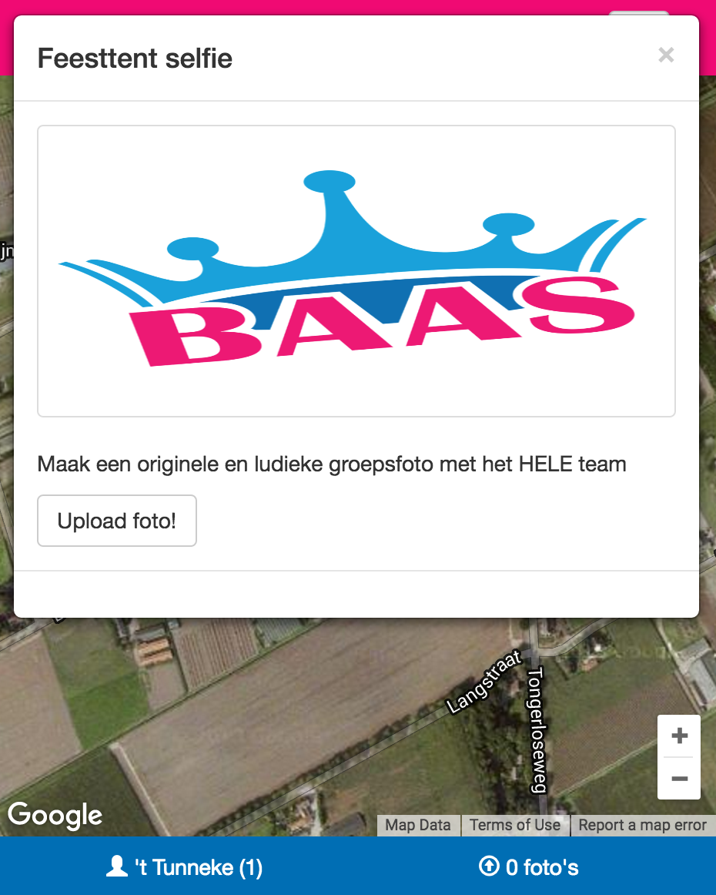

# gps-photo-game
The end game - Baas van Horst aan de Maas 2016 - GPS Photo game --> Go to a specific GPS location, take a photo and score points!

App that uses the Google Maps API to show points added by the administrator. The app tracks the position of the users and drops a modal when the user is at one of the points on the map. The modal contains content entered by the administrator and allows photo upload. The app can be used for a quest in which the user has to solve the mistery by solving hints or puzzles given at specific points and/or upload photos.

